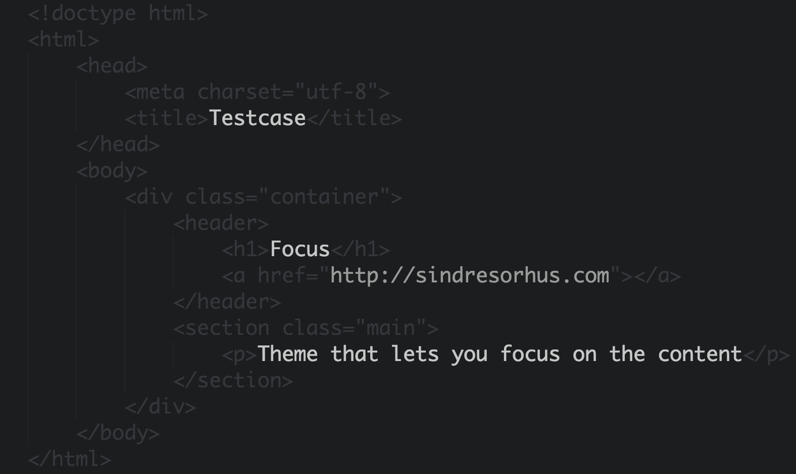
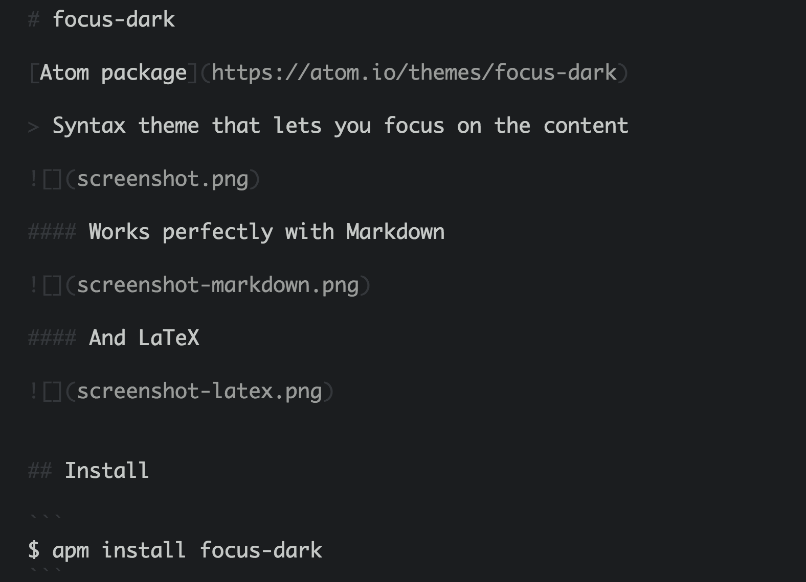
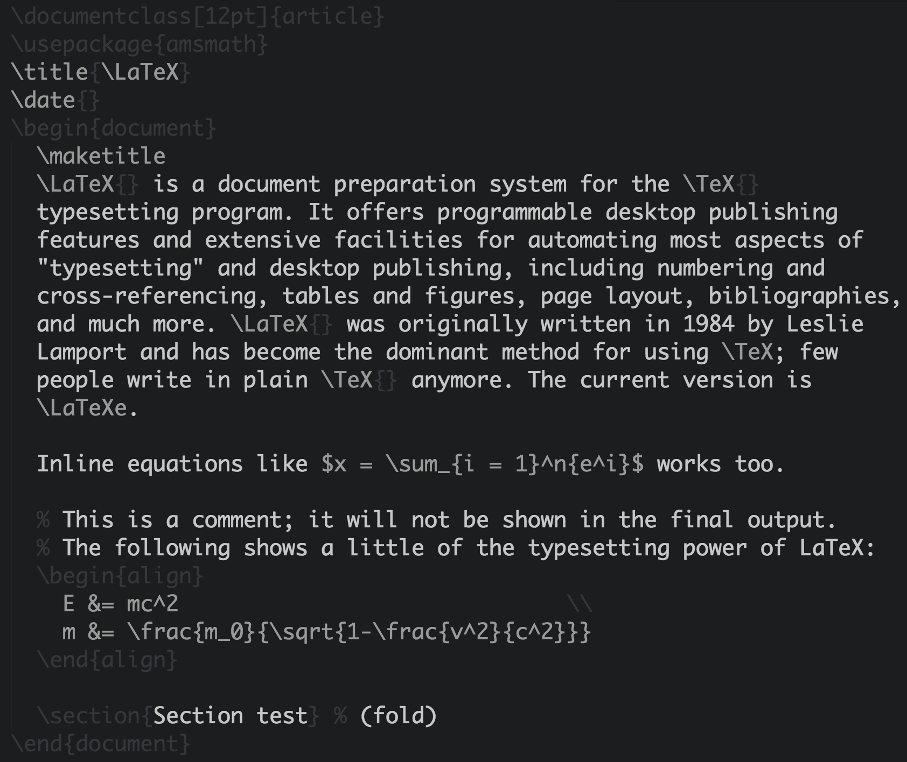

# focus-dark

> Syntax theme that lets you focus on the content



#### Works perfectly with Markdown



#### And LaTeX




## Install

```
$ apm install focus-dark
```

Or Settings → Install → Select `Themes` → Search for `focus-dark`


## Dev

Find the current scope by pressing `⌘⌥P`.


## Related

See [focus-light](https://github.com/sindresorhus/atom-focus-light) for the light version.

[Also available on Sublime Text, TextMate, Vim, Chocolat, etc.](https://github.com/sindresorhus/focus)


## License

MIT © [Sindre Sorhus](https://sindresorhus.com)
